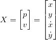
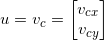
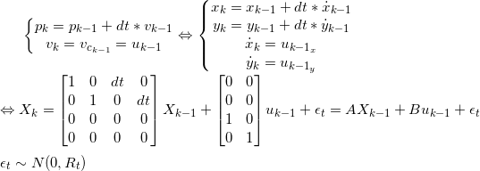
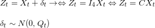

# Conveyor Belt Simulator and State Estimation
This is a simple simulator for a conveyor belt, with the purpose to enable research and test algorithms related to state estimation and tracking of objects on the conveyor.
Originally, this project treated boxes, but it can abstract any object with similar dimensions and characteristics.

This simulator uses python2.7, pygame and pykalman.

## Running
There are 3 scripts in the repo, all can be executed with python 2.7:
1. conveyorKalman.py: Runs the full simulation and state estimation as described in the next section.
2. genetorSimle.py: Simple version with basic environment modelling and without the state estimation.
3. conveyorSimRos_deprecated.py: A deprecated buggy version with ROS

## Models and State Estimation
### Environment Model
The environment represents the conveyor belt. It is represents by width and height, a direction and speed of motion, as well as an area which represents a free area without moving belt (e.g. a collection area). As a result, objects on the conveyor move in at the conveyor speed along its direction and stop when reaching the limit. The conveyor linear speed is generated from an uniform distribution, given a mean and a standard deviation.
In addition, boxes move perpendicularly to the conveyor's direction with a speed given by an uniform distribution given a mean and a standard deviation. this reprensents the noise in motion of the objects, which may slip on the conveyor.
objects touching each other or the walls will bounce back.

At each time steps, all objects in the environement move according to their state. If they are free, they move with the conveyor as described previously. If they are in collision, they bounce. And if they are in the static area, they would stay put.

Full parameters list for the environment:
  width
  height
  boxes = list of all boxes
  dt = simulation time step
  env_limits = defines the free area
  nLanes = number of "lanes" on the conveyor at which objects can start
  env_speed = angle and speed of conveyor (mean and std)
  perp_speed = speed of motion perpendicularly to conveyor's direction (mean and std)
  new_box_interval = interval to add a new box to the conveyor
  pixel resolution
  elasticity = walls elasticity for collisions

### Objects (boxes) Model
Objects are represented by a rectangle - centroid's position, width and height. The width and height are generated from a uniform distribution with a mean and a standard deviation.
Objects are always generated at the top of the conveyor, but can start horizontally on any of the environment's lanes.
Objects also have elasticity.

### State Estimation
In addition to simulation the conveyor belt, we provide a state estimation of the objects using a Kalman Filter.
Using pykalman, each object is associated with a Kalman Filter that estimates its centroid's position. At each timestep, after the objects moved by the simulation, an observation of their position is taken. The observation is corrupted using additive Gaussian noise.

The object's position is then estimated using the KF. The prediction step is done using the ideal conveyor's speed, and the correction step using the noisy observation.
The following equations describe the system:

State:

Input:

System:

Where epsilon is a Gaussian additive process noise.

Measurement Model:
Since we are directly observing the object's location and speed, the observation model is:

Where delta is a Gaussian additive measurement noise.

## Results
Some videos in the `videos` folder show results for different level of noise.